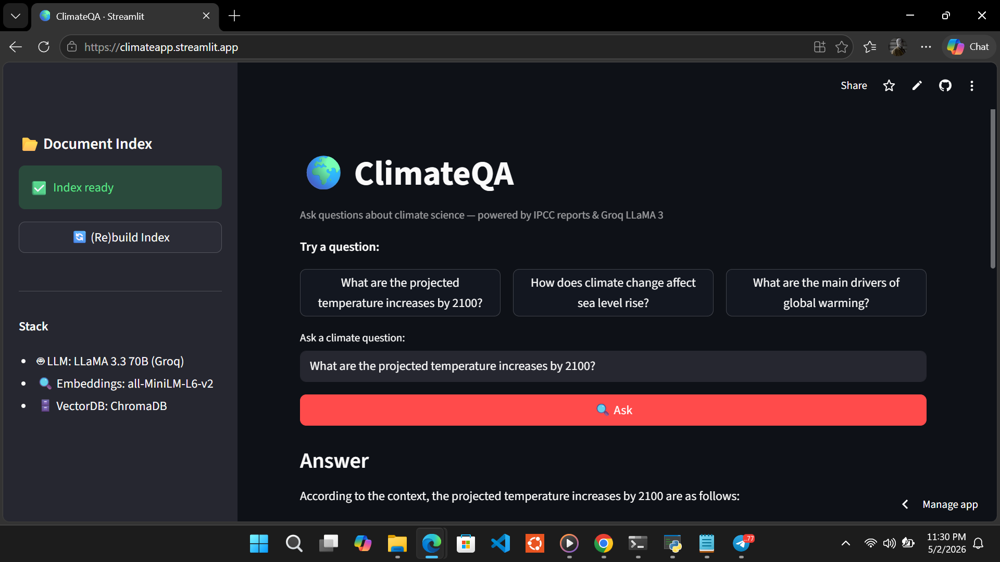

# 🌍 ClimateQA
> A production RAG system for querying IPCC AR6 climate reports using natural language.
[](https://github.com/TheBishop/ClimateQA/actions/workflows/ci.yml)
**[Live Demo](https://climateapp.streamlit.app)** | **[API Docs](https://climateqa-production.up.railway.app/docs)** | **[Author](https://x.com/O0hene)**

## The Problem
Climate scientists and policymakers need fast, accurate access to IPCC findings. Reading 3,000+ pages of AR6 reports manually is impractical. ClimateQA lets you ask plain-language questions and get cited, grounded answers in seconds.
## Architecture
IPCC AR6 PDFs ↓ [Ingest] PyPDF → RecursiveCharacterTextSplitter (800 tokens, 150 overlap) ↓ [Embed] all-MiniLM-L6-v2 (local, CPU) → ChromaDB (MMR retrieval, k=5) ↓ [Generate] LLaMA 3.3 70B via Groq → answer + page-level citations ↓ [Observe] Langfuse (latency, token count, cost per query) ↓ [Serve] FastAPI (Railway) + Streamlit (Streamlit Cloud)

## Evaluation (RAGAS, n=20 questions)

| Metric | Score |
|--------|-------|
| Faithfulness | 0.714 |
| Answer Relevancy | 0.973 |

Evaluated on 20 domain-specific questions drawn from IPCC AR6 WG1 topics using LLaMA 3.1 8B as the judge model.

## Tech Stack

| Layer | Tool |
|-------|------|
| LLM | LLaMA 3.3 70B (Groq) |
| Embeddings | all-MiniLM-L6-v2 (sentence-transformers, CPU) |
| Vector DB | ChromaDB (MMR retrieval) |
| Orchestration | LangChain |
| API | FastAPI |
| UI | Streamlit |
| Observability | Langfuse |
| CI/CD | GitHub Actions |
| Deployment | Railway (API) + Streamlit Cloud (UI) |

## API Usage

```bash
curl -X POST https://climateqa-production.up.railway.app/ask \
  -H "Content-Type: application/json" \
  -d '{"question": "What are projected sea level rises by 2100?"}'
```

Response:
```json
{
  "question": "What are projected sea level rises by 2100?",
  "answer": "According to IPCC_AR6_SPM.pdf...",
  "sources": [{"file": "IPCC_AR6_SPM.pdf", "page": 13, "snippet": "..."}],
  "latency_ms": 8816.01
}
```

Interactive docs: https://climateqa-production.up.railway.app/docs

## Quick Start

```bash
git clone https://github.com/TheBishop/ClimateQA
cd ClimateQA
python -m venv venv && source venv/bin/activate
pip install -r requirements.txt --extra-index-url https://download.pytorch.org/whl/cpu
cp .env.example .env  # add your GROQ_API_KEY
python -m src.ingestion.ingest
streamlit run app.py
```

## Project Structure

ClimateQA/ ├── app.py # Streamlit UI ├── src/ │ ├── ingestion/ingest.py # PDF loading, chunking, embedding │ ├── retrieval/retriever.py # ChromaDB MMR retrieval │ └── api/ │ ├── main.py # FastAPI routes │ └── chain.py # RAG chain + Langfuse observability ├── notebooks/ │ ├── evaluate.py # RAGAS evaluation script │ └── ragas_results.csv # Full evaluation results ├── tests/ │ └── test_api.py # Smoke tests (CI/CD) ├── .github/workflows/ci.yml # GitHub Actions CI ├── Dockerfile # Container definition └── data/pdfs/ # Source documents (IPCC AR6)

## About

Built by **Dzahene Richmond** — Teaching & Research Assistant, Dept. of Meteorology & Climate Science, KNUST, Ghana.

Meteorologist learning AI engineering in public. Climate × AI is an underexplored space in Africa — this is the first of several projects at that intersection.

[𝕏 @O0hene](https://x.com/O0hene) | [GitHub @TheBishop](https://github.com/TheBishop)
